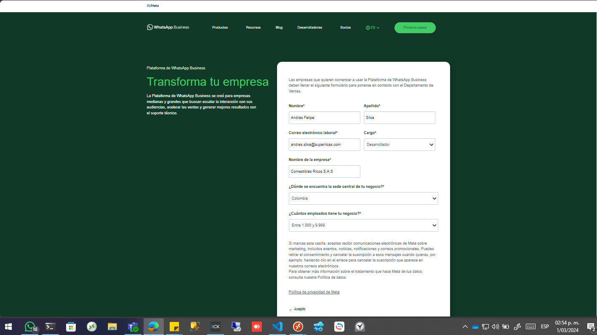

# Cómo utilizar la API de WhatsApp para enviar mensajes a los clientes (sin usar servicios externos)

## Introducción

La **API de WhatsApp Business** permite a las empresas enviar mensajes a sus clientes a través de WhatsApp. A continuación, se detalla el proceso paso a paso para llevado a cabo para el uso la API de WhatsApp directamente con fines coorporativos en Comestibles Ricos S.A.S:

## Requisitos previos

1. **Cuenta de WhatsApp Business**: Se debe tener una cuenta de WhatsApp Business para acceder a la API. Se registro una cuenta de desarrollador de software en el siguiente link: [WhatsApp Business](https://www.whatsapp.com/business/) el registro indica que se estará enviando información sobre el acceso a la API. Una vez registrado, WhatsApp revisará la solicitud y otorgará acceso a la API si se cumple con los requisitos. Esto puede incluir verificar que eres una empresa legítima y que cumplas con sus políticas de uso.
   

2. **Crear una cuenta en Facebook developers y la suite de bussines** Crear una cuenta en Facebook developers, luego crear una apliación y bincular o crear una cuenta en Meta Bussines Suite para poder hacer el **desarrollo** limitado y despues pasarlo a producción.

3. **Número de teléfono verificado**: Verifica tu número de teléfono en WhatsApp Business.

4. **Credenciales de la API**:
   - Se debe registrar en el portal de desarrolladores de WhatsApp Business.
   - Luego, se deben obtener las credenciales necesarias, como el **token de acceso**.

## Paso a paso

### 1. Configuración de la API

- Regístrate en el portal de desarrolladores de WhatsApp Business.
- Obtén tu token de acceso.

### 2. Configuración del entorno

- Elige un lenguaje de programación (por ejemplo, Python, Node.js o Java) para interactuar con la API.
- Configura las variables de entorno con tus credenciales.

### 3. Autenticación

- Utiliza tus credenciales para autenticarte con la API. Esto generalmente implica enviar una solicitud HTTP con tu token de acceso.

### 4. Envío de mensajes

- Utiliza las rutas y endpoints proporcionados por la API para enviar mensajes a través de WhatsApp.
- Puedes enviar mensajes de texto, imágenes, documentos y más.

### 5. Manejo de respuestas

- Implementa la lógica para procesar las respuestas de los clientes.
- Escucha las notificaciones de entrega y lectura.

### 6. Prueba y depuración

- Prueba tu implementación con núme
- ros de teléfono reales o con números de prueba proporcionados por la API.
- Asegúrate de manejar errores y excepciones correctamente.

### Recursos relevantes

- [Whatsapp Bussines for developers](https://business.whatsapp.com/developers/developer-hub?lang=es_LA)
- [Meta for developers](https://developers.facebook.com/?no_redirect=1)
- [Facebook for developers how sing up](https://developers.facebook.com/docs/development/register)
- [Iniciar sesión en Facebook for developers](https://www.facebook.com/login.php?next=https%3A%2F%2Fdevelopers.facebook.com%2Fasync%2Fregistration)
- [Crear cuenta comercial en Meta](https://business.facebook.com/overview/?business_creation_redirect_uri=https%3A%2F%2Fdevelopers.facebook.com%2Fapps%2F3344396579036872%2Fwhatsapp-business%2Fwa-dev-console%2F)
- [Meta for developers apps](https://developers.facebook.com/apps/)
- [Get started with Whatsapp](https://developers.facebook.com/docs/whatsapp/cloud-api/get-started)
